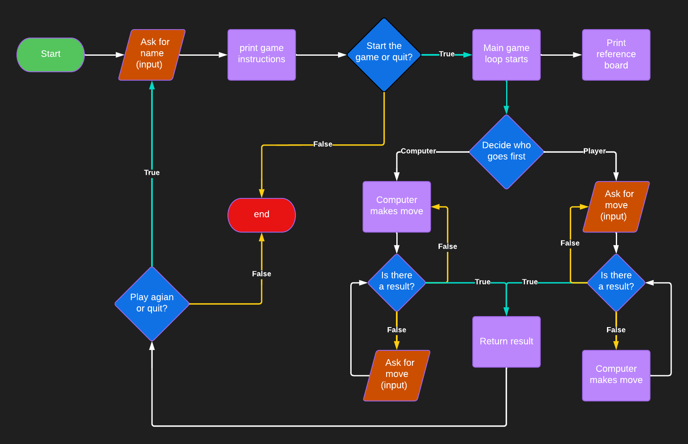
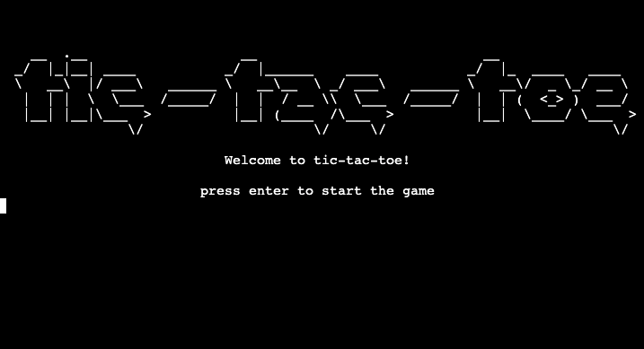
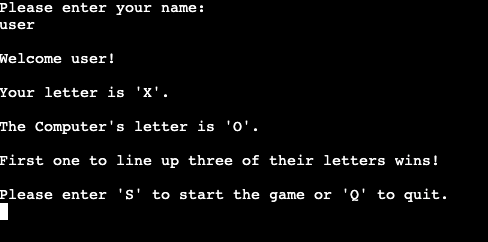
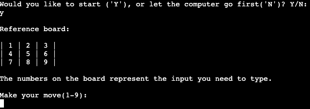
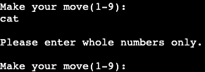
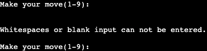
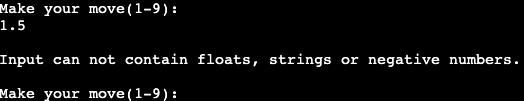
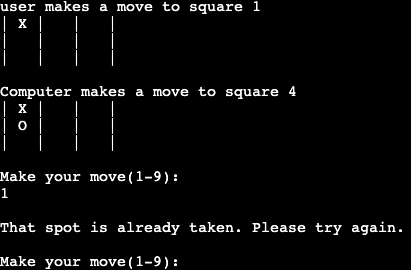
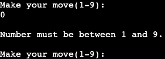

# tic-tac-toe-with-python

Tic-tac-toe-with-python is a simple game meant to be played in a Python terminal, provided by Heroku.
Users of this game will play against the computer with the goal of lining up three of their marks/letters in a row, column or a diagonal way.

Live version link

# How to play
Tic-tac-toe-with-python is based on the original game of tic-tac-toe.
1. At first, the user is asked to enter a name that will be displayed throughout the game.
2. Then the game tells the user the instructions, and the marks/letters the user and the computer is assigned.
3. At this point the user will be asked if they want to start the game or quit.
4. If the user has decided to start the game, they will be asked to decide who makes the first move.
5. The game proceeds according to previous decision and asks both the computer and the user to make their move.
6. This process is repeated until there is a winner, or there are no empty spaces left on the board.
7. After the result is printed the user can decide if they want to play again, thus restarting the program.

# Flowchart of the program

# Features 
As listed in the How to play section:
* The starting screen shows the game title and asks the user to hit enter to play the game.

* Print the instructions of the game, inform the user what mark/letter they are assigned.

* Feature to ask the player to decide on who is going to make the first move on the board.
* The game prints the reference board and tells the user which index on the board refers to which number that they can input.

* The game will start based on the user's previous decision.
* The user and the computer are both asked to make a move until there is a winner, or there are no empty spaces left on the board.
* The computer makes it's move by random based on the remaining indices of the board.
* The user is asked to type in their move manually.
* The program is handling errors with informing the player if they have entered an invalid input.

## Error Handling:
---
Invalid user inputs include:
1. Strings (words or letters)
* The user is asked to enter whole numbers only.\

2. Whitespaces or no input at all.
* The user is asked to avoid entering empty string.\
\
3. Floating point numbers, negative numbers, or input that contains numbers and strings at the same time.
* The user is told that they can not enter floats, negative numbers or strings.\
  

If all of the above has been validated, the user input is converted into an integer, and then once again, the program checks for validation.

## Further error handlings:
---
Errors:\
1. ValueError: Input referring to an index on the board that is not available.
* The user is told that their desired spot has been taken.\

2. IndexError: Input is referring to an index that does not exist in the available moves
* Input needs to be between 1 and 9
* Input can not be 0
* Input can not be over the number 9\

After the game ends with a result of win or a tie, the user is asked if they want to play again, or quit the game.

# Possible features to implement in the future
At this stage the computer is relatively easy to beat. The computer is not introduced to the rules of the game and only makes it's decision by choosing a random spot that is still available on the board. This means if the computer has 2 of their letters lined up and with their next move they would be able to win the game, the pattern does not get recognized and it is possible that the computer will miss their chance. The same goes for preventing the player from lining up their letters.

* This makes it considerable to implement an AI to the program, that is able to recognize the outcomes of each possible move and prioritze their decision to win the game with the least possible moves.

* A feature to keep the entered name throughout the game without asking the user to input every time they want to play a new game.

* A feature to let the player decide what letter they want to use. (The default is "X" for the player, and "O" for the computer).

# Object Oriented Programming
For the main logic of the game I used a tutorial (see credits) to create classes for the game and the players.

* The Player superclass has two subclasses, RandomComputerPlayer, and HumanPlayer, both these classes inherit from their superclass, and has a method for getting their move.

* The TicTacToe class stores the 3x3 game board, and the winner's letter. This class also has methods to make a list of the available moves, check if there are empty spots left on the board, assign the move of the players to the board and check for a winner.

# Technologies used
* Code Institute's python essentials template
* GitHub for version control
* GitPod for writing and testing the program manually.
* Heroku for deploying the project

# Imported libraries

time and sys
* to make a short delay in printing to the terminal to make it easier to read

os 
* to make a function that declutters the terminal when it becomes crammed

random
* to generate random choices for the computer during the game

# Testing and validation
## PEP8
 * Confirmed that [Code Institute's PEP8 validator](https://pep8ci.herokuapp.com) found no errors

## Manual
* All listed features have been tested thoroughly on several trials in the GitPod terminal.
* Tested for every possible invalid inputs.

## Bugs and problems
---
### Solved
* After the player decided to play the game again, the program restarted but the board remained filled with the last game's entries, thus preventing to play the game properly. This was caused by a class instance that was created outside of the main game function.
* Quitting the game would not work properly, unless the right input was made. This was caused by the lack of input handling within the function. Adding an else statement solved it by continuing to ask for the correct input.
* Input handling did not accomodate for floating point numbers, and inputs that included both numbers and strings at the same time. Error for this message was handled as if it was a spot already taken on the board. Making the sure the input was a number with isdigit() method helped solving this.

### Unsolved 
* After many hours of testing I have nout found any bugs left unfixed.
# Deployment

Deploying this page was made possible with the use of GitHub and Heroku with the following steps:
1. Create a new account on Heroku and connect it with my GitHub account.
2. Sign in to Heroku
3. Click on "New" and select "Create new app"
4. Name app and choose region(select Europe)
5. Once the app is created, navigate to Settings tab and add the following buildpacks:
   1. 'heroku/python'
   2. 'heroku/nodejs'
6. Create Config Var called 'PORT' as KEY, and '8000' as VALUE
7. Navigate to Deploy tab and select GitHub as Deployment method
8. Click Connect to GitHub
9. With our GitHub profile selected, search for the correct GitHub repository and click "Connect"
10. Once the connection is done, select Enable Automatic Deploys (to make sure heroku rebuilds the latest version after the final chages have been pushed to GitHub)
11. Finally select Deploy Branch in Manual deploy to make the initial deyploment.(Automatic deploys work only after this step.)

# Credits
* Code Institute's python essentials [template](https://github.com/Code-Institute-Org/python-essentials-template)
* For implementing OOP and making the main logic of the game: [12 Beginner Python Projects - Coding Course](https://youtu.be/8ext9G7xspg?t=2154)
* For the type_slow(), wipe() and Strin center() method: [stackoverflow](https://stackoverflow.com/)
* For exception handling and list comprehension: [W3Schools](https://www.w3schools.com/)
* for the ASCII art that appears on the starting screen: [Text to ASCII Art Generator](https://patorjk.com/software/taag/#p=testall&f=Stick%20Letters&t=tic-tac-toe)
